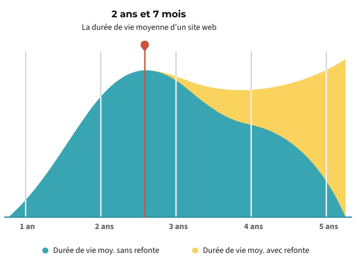
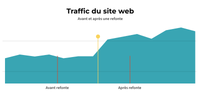
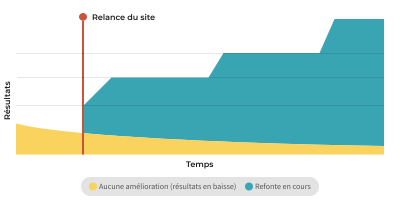
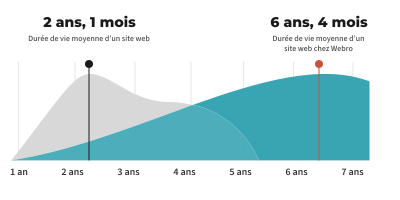

Un jour, un client me demande : "Combien de fois on doit refaire notre site web ?"

Ma réponse à l'époque était 4 ans. Ma réponse de base a toujours été de 3 à 5 ans, selon l'industrie. Mais ça dépend de plusieurs facteurs.

Depuis, on a fait des recherches pour vraiment répondre à la question...

## Quelle est la durée de vie moyenne d'un site web ?

On a examiné 50 des meilleurs sites web pour voir à quel intervalle ils sont refait.

**La durée de vie moyenne d'un site web pour les grandes entreprises est de 2 ans et 1 mois.**

C'est court, mais ce sont de grandes entreprises avec beaucoup de budgets. En plus, une [étude de Databox sur l'âge des sites web](https://databox.com/website-age) a interrogé 145 petites et moyennes entreprises (PME) et a trouvé que 45% d'entre elles ont complètement refait leur site web au cours des 2 dernières années.

Une autre donnée montre que certaines entreprises ont une durée de vie moyenne de 6 ans et 4 mois.

Vous pensez probablement que 6 ans semblent être une longue période, et vous avez raison ! Alors, pourquoi certaines entreprises peuvent attendre 4, 5 ou 6 ans entre les refontes de leur site web, alors que d'autres continuent à le refaire tous les deux ans ?

La question est compliquée pour plusieurs raisons :

- Le secteur dans lequel vous travaillez aura un impact énorme sur la longévité de votre site web. Les entreprises dans les domaines très concurrentiels sont plus susceptibles de refaire plus fréquemment.
- D'autres facteurs comme les [attentes des visiteurs](https://www.orbitmedia.com/blog/website-features-content/), les modifications apportées au site web, les directives de marque, mises à jour... joueront tous un rôle dans la longévité de votre site web.
- Si elle est réalisée correctement, une refonte de haute qualité peut durer plus de 5 ans, contrairement à un travail de moindre qualité. C'est en partie la raison pour laquelle il est si important de trouver une entreprise spécialisée dans les sites web (conception, développement web et SEO).

Si vous laissez un site web en ligne au-delà de sa date de "péremption", les résultats commenceront à décliner.

Examinons en détail certains des principaux facteurs qui influencent la durée de vie d'un site web.

## 10 facteurs qui influencent la durée de vie d'un site web

Ce que l'on peut dire avec certitude, c'est que tous les sites web doivent être refaits un jour ou l'autre. C'est indispensable pour rester au niveau de la concurrence dans votre secteur et s'adapter aux besoins et aux normes changeantes des utilisateurs et du web.

Il existe de nombreuses raisons pour lesquelles les sites web sont refaits :

_Quand et pourquoi il faut refaire son site web ? Pour répondre à ces questions, posez-vous les questions suivantes :_

### 1. Mon entreprise a évolué ?

Votre site web doit refléter fidèlement votre entreprise. Si vous avez apporté des modifications importantes à votre entreprise comme l'image de marque ou vos offres, vous avez certainement besoin d'un site web mis à jour.

### 2. Ma stratégie de contenu a changé ?

Vous publiez plus, organisez des événements ou modifiez votre façon de publier et de créer du contenu ? Votre site doit refléter ces évolutions et être repensé en tenant compte des nouvelles opportunités d'optimisation des moteurs de recherche (SEO) et de conversion.

### 3. Mon secteur d'activité a évolué ?

Votre entreprise et votre secteur d'activité peuvent être façonnés par de nombreux facteurs : nouvelles technologies, évolution des meilleures pratiques, événements actuels, tendances du marché, etc. Votre site peut être un fort reflet de votre position sur le marché.

> Refaire les sites web, c’est comme discuter de politique sur les réseaux sociaux. Chaque crétin a une opinion et veut avoir le dernier mot. Je ne donne pas mon feu vert à un processus de refonte à moins qu’il n’y ait d’autres raisons, comme le lancement d’un nouveau produit, l’attaque d’un nouveau marché ou le changement du positionnement de l’entreprise. Ce n’est pas parce que les gens s’ennuient avec le design ou la copie qu’il y a une raison suffisante pour faire un remaniement. Les entreprises qui s’ennuient avec leurs messages devraient faire des tests A/B et laisser leur audience voter en cliquant sur leur message. Une performance médiocre n’est pas non plus un problème. La performance est généralement due au fait que les entreprises ne consacrent pas suffisamment de temps à apporter les changements nécessaires pour augmenter le trafic de recherche et améliorer les chemins de conversion. - Peter Caputa, Fondateur de [Databox](https://databox.com/)

### 4. Est-ce que je travaille dans un secteur lié au design ou à la technologie ?

Le secteur dans lequel vous évoluez joue un rôle important dans la longévité d'un site web. Les temps changent plus vite pour les entreprises du marketing digitale, de la publicité, du design et des technologies, tout comme les sites web. Être le plus lent à refaire votre site web dans votre secteur vous met dans une position désavantageuse...

### 5. Mon site est en phase avec les tendances en matière de design ?

Un site web qui n'est pas à jour avec [les tendances et les meilleures pratiques de conception web](conseils-de-conception-web) peut nuire à votre crédibilité et détourner les utilisateurs, par rapport à des sites plus modernes et mis à jour.

### 6. Mon site est utilisable et visuellement attrayant sur les petits écrans ?

Le nombre d'utilisateurs de sites web sur mobile et tablette a considérablement augmenté. Si votre dernière refonte remonte à 6 ans, il est possible que la plupart de vos visiteurs utilisent aujourd'hui des appareils complètement différents.

### 7. Mon site est difficile à mettre à jour ?

Les systèmes de gestion de contenu se sont améliorés. De nos jours, il devrait être rapide, gratuit et facile d'apporter la plupart des modifications au contenu de nos sites web.

### 8. Mon classement et mon trafic de recherche ont diminué ?

À moins que vous ne promouviez et n'optimisiez activement le contenu de votre site web, les classements ont tendance à baisser au fil du temps. Une refonte peut inverser la tendance à la baisse du trafic de recherche grâce à un nouveau plan de site axé sur les phrases clés, avec de nouvelles pages ciblant de nouvelles phrases.

### 9. Mon taux de conversion est en baisse ?

Les attentes des visiteurs ne cessent d'augmenter. Si votre site web ne s'améliore pas en permanence, les taux de conversion ont tendance à baisser. Une refonte peut inverser le processus de vieillissement grâce à une nouvelle conception optimisée pour la conversion, qui résonne mieux auprès de vos utilisateurs.

### 10. Mes concurrents ont récemment refait leur site ?

C'est la grande question : que font vos concurrents ? L'âge de votre site est relatif à celui de vos concurrents. Si d'autres entreprises de votre secteur ont un site conçu et lancé plus récemment, elles peuvent voler la vedette et attirer des prospects potentiels.

### Alors, quelles ont été vos réponses ?

Si vous avez beaucoup répondu "oui", il est probable que votre site commence à montrer des signes de vieillissement. Une refonte de votre site web est un moyen efficace de le réinitialiser. Vous pouvez ainsi vous assurer que votre site vous positionne comme une source crédible dans votre secteur et qu'il reflète vraiment qui vous êtes, ce que vous faites et où vous allez.

## Comment prolonger la durée de vie d'un site web ?

Effectuer des mises à jour et des optimisations fréquentes sur votre site web est l'un des meilleurs moyens d'inverser ou de retarder le processus de vieillissement. Voici quelques méthodes pour actualiser votre site à l'aide de mises à jour de contenu, de mise en page et de conception :

**Actualisez votre contenu :** créer et ajouter du nouveau contenu, comme des textes actualisés, des images, des vidéos et des articles de blog, peut faire une grande différence. Non seulement ces ressources peuvent être réutilisées pour une refonte ultérieure, mais elles peuvent également actualiser votre stratégie de référencement, améliorant potentiellement votre classement pour diverses expressions clés.

**Optimisez votre navigation :** effectuez des recherches pour savoir quels liens les utilisateurs visitent le plus dans votre liste et dans votre navigation principale et secondaire. Pensez à réduire votre navigation en supprimant les liens avec lesquels les utilisateurs interagissent le moins. Cela peut rafraîchir l'apparence de votre navigation et attirer davantage l'attention sur les pages qui génèrent de l'engagement et des conversions.

**Mettez à jour les éléments de conception mineurs :** apportez de petites modifications à votre typographie et à votre palette de couleurs sur l'ensemble de votre site. Cela peut mettre votre site à jour avec votre marque, rafraîchir l'apparence et peut même donner l'illusion d'un nouveau site web. De petits changements peuvent faire une énorme différence !

**Améliorations de la mise en page :** considérez ça comme un lifting : l'intégration de nouvelles mises en page pour les pages clés de votre site, ou même simplement pour votre page d'accueil, peut donner à votre site un aspect neuf aux nouveaux visiteurs. Identifiez certains des points faibles de votre site, là où il montre des signes d'usure, pour tirer parti des tendances de conception plus modernes.

Certaines pages peuvent avoir besoin d'un "coup de pouce" : les pages à plus fort trafic et les pages de sortie les plus fréquentées. Selon le rapport de Databox, environ 1/4 des entreprises interrogées ont apporté des modifications à la mise en page de leur site au cours de l'année écoulée.

Gardez à l'esprit que la valeur de tout changement est relative au coût. Par conséquent, si vous envisagez de repenser votre site prochainement, n'investissez pas trop de temps et d'argent dans des modifications et des mises à jour mineures.

## Le ROI d'une refonte d'un site web

Un excellent site web soutient votre entreprise de plusieurs manières :

- **Visibilité de la recherche :** plus de personnes peuvent trouver et en savoir plus sur votre entreprise.
- **Accessibilité :** plus de personnes peuvent utiliser votre site web efficacement.
- **Rentabilité :** plus d'utilisateurs s'engagent et convertissent.
- **Crédibilité :** un site web mis à jour et de qualité contribue à gagner la confiance des utilisateurs.
- **Évolutivité :** votre site peut grandir, s'étendre et évoluer en même temps que votre entreprise.

Concevoir un nouveau site qui aborde tous ces facteurs peut prendre beaucoup de temps et d'efforts. C'est quelque chose que vous voulez faire correctement. La bonne nouvelle est qu'un site web bien conçu sera efficace pendant une période plus longue et que le retour sur investissement de votre site web suivra le même chemin.

## L'essentiel à savoir

Lorsque votre entreprise ou vos visiteurs changent, votre site web vieillit. Il vieillit dès qu'il n'est plus en phase avec vos objectifs et ne vous apporte plus de résultats mesurables.

Le moment où cela se produit dépend énormément des mises à jour de votre site que vous avez effectuées, du secteur dans lequel vous évoluez, de la qualité de la dernière refonte de votre site et de toutes les mises à jour au sein de votre entreprise.

_Note de l'éditeur : mon conseil est de garder votre site aussi jeune et frais que possible en mettant à jour le contenu, le design et la mise en page, mais soyez prêt à prendre la décision difficile de le refaire. Et lorsque vous le faites, n'oubliez pas qu'un excellent site web produira des résultats pendant 5 ans ou plus, tandis qu'un site web mal conçu aura besoin d'une autre refonte dans les 2 ans ou moins..._
