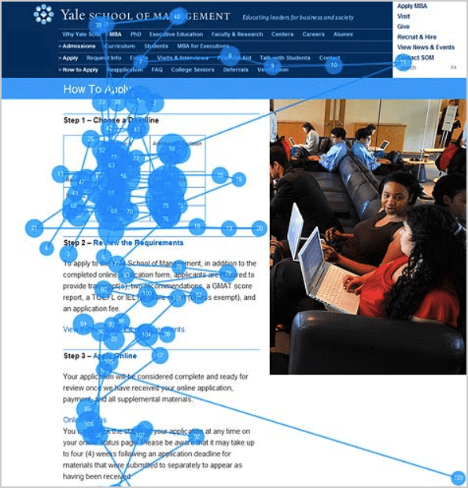
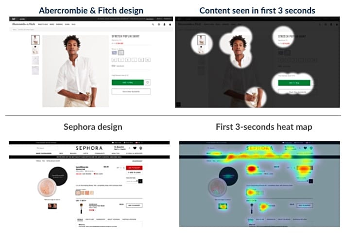
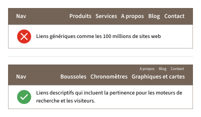

C'est facile à voir le nombre total de visiteurs. Chaque marketeur sait combien de trafic ils obtiennent, parce que c'est juste là dans l'analyse. Mais ce qui se passe ensuite n'est pas aussi évident.

C'est pourquoi il est facile de donner des conseils pour le SEO, mais les conseils pour la conception web sont une autre histoire. Il y a tellement de facteurs. Même après des années d'expérience, il est difficile pour nous de savoir ce qui fonctionnera le mieux.

**Cet article contient 27 conseils de conception web pour obtenir un meilleur site web.** La plupart de ces conseils sont appuyés par des recherches. Ces conseils sont destinés aux concepteurs débutants/professionnels, aux PME et aux grandes entreprises.

Voici nos meilleurs conseils, idées et inspiration sur la façon de concevoir un site web qui obtient des résultats. Un site qui a l’air magnifique, convertit les visiteurs et tire plus de valeur de chacune de ces visites durement gagnées.

*Les deux études les plus importantes sont à la toute fin. Si vous êtes impatients, passez votre chemin !*

## La structure d'un site web

Les sites web sont deux choses : le conteneur et le contenu. Le conteneur contient la structure et le style. Commençons par le celui-ci. Ces conseils concernent la structure et le style des pages.

### 1. Utilisez une hiérarchie visuelle

Chaque page a une hiérarchie visuelle. Si vous ne connaissez pas ce concept, voici notre définition :

> La hiérarchie visuelle fait référence à l'arrangement, la taille, la couleur et le contraste des éléments visuels. Elle détermine leur importance relative et l'ordre dans lequel ils sont vus par l'œil humain.

Les concepteurs de sites web utilisent la hiérarchie visuelle pour guider l'attention des visiteurs vers les éléments importants en premier. La mise en page du site web comprend la position (haut ou bas sur la page), les tailles (grandes ou petites), les visuels (vidéo, images, icônes) et le contraste (couleur et espace blanc).

La combinaison d'entre elles multiplie leur effet. Tout le monde verra une grande vidéo, en haut de la page, mais peu de gens verront du texte à faible contraste entouré d'images.

La hiérarchie visuelle est la raison pour laquelle vos yeux suivent un certain chemin sur chaque page que vous visitez sur le web. Lorsqu'il est bien utilisé, il guide l'attention du visiteur à travers une série de messages vers un appel à l'action.

### 2. Utilisez un titre descriptif en haut de la page d’accueil, axé sur un mot-clé

Le titre en haut de chaque page est soit descriptif ou non. Si ce n’est pas le cas, le visiteur ne sera peut-être pas en mesure de répondre à sa première question : *"Je suis au bon endroit ?"*.

C'est aussi l'occasion d'utiliser un mot-clé et d'indiquer la pertinence. Mais beaucoup de sites web écrivent quelque chose de malin ou vague à la place. *Mais vaut mieux être clair que malin.*

Plutôt que d’écrire un titre fantaisie, mais vague, écrivez quelque chose de descriptif. Assurez-vous d’expliquer ce que fait l’entreprise en haut de la page, au-dessus du pli.

### Attends, c'est quoi le pli ?

Sur chaque écran, il y a une zone de visualisation. Au bas se trouve le fameux pli. Pour voir quelque chose en dessous de cette ligne, le visiteur doit faire défiler. Prenons la même image qu'avant et définissons le pli pour un iPhone 14 Pro Max, par exemple.

Il y a un "pli moyen" pour chaque écran et c'est important de savoir ce que vous allez mettre au-dessus et en-dessous de lui. [Une étude](https://www.nngroup.com/articles/scrolling-and-attention/) montre que les visiteurs passent 80% de leur temps au-dessus du pli.

**Alors, dites ce que vous faites en quelques mots et mettez votre proposition de valeur au-dessus du pli.**

### 3. Mais ne mettez pas tous vos appels à l'action au-dessus

Les visiteurs passent peut-être plus de temps là-bas, mais ça ne signifie pas qu'ils sont prêts à agir. Beaucoup de persuasion se produit plus loin sur la page.

Lorsque Chartbeat a [analysé 25 millions de visites](https://blog.chartbeat.com/2013/08/12/scroll-behavior-across-the-web/), ils ont constaté que la plupart des engagements se produisent en dessous du pli. Le contenu en haut peut être visible, mais ce n'est pas nécessairement l'endroit le plus efficace pour mettre vos appels à l'action.

*Une mise en garde à propos de cette étude : Chartbeat est utilisé principalement par les sites d'actualités, qui sont très différents des sites de marketing. Personne ne fait grand-chose au-dessus du pli sur un site d'actualités !*

**Assurez-vous de placer les appels à l'action plus loin sur la page, dans tous les endroits où l'intérêt est susceptible d'être élevé.**

### 4. Faites une grande page d'accueil. Répondez à toutes les questions de vos visiteurs

Plus de pixels signifie plus d'espace pour répondre aux questions, traiter des objections et ajouter des preuves. Si le visiteur ne trouve pas de réponse à une question importante, il peut simplement continuer à descendre la page. Une fois qu'ils sont satisfaits, ils arrêtent tout simplement de lire.

> Les pages de vente les plus efficaces simulent une conversation de vente.

Vous ne couperez jamais la parole à quelqu'un pendant une réunion de vente et cesserez de répondre à ses questions, n'est-ce pas ?

C'est là que la fameuse [étude de Crazy Egg](https://conversion-rate-experts.com/crazy-egg-case-study/) entre en jeu. Ils ont sondé leur auditoire, découvert leurs principales questions et préoccupations et ont créé une page d'accueil qui traite de tout.

**La page était 20 fois plus longue, mais le taux de conversion a augmenté de 30%.**

### 5. Montrez une chose à la fois

> "J’aime les designs propres et modernes."

C’est ce que la plupart des gens disent lorsqu'ils veulent un site web. Ils se réfèrent souvent au site web d’Apple à titre d’exemple.

**Les visiteurs n’aiment pas l’encombrement. Ils aiment les espaces blancs et la simplicité.**

En 2012, Google a entrepris de découvrir [quels types de sites sont considérés comme beaux par les visiteurs](https://research.google/pubs/the-role-of-visual-complexity-and-prototypicality-regarding-first-impression-of-websites-working-towards-understanding-aesthetic-judgments/). Il s’agit d’une étude sur la simplicité avec un nom très compliqué (je vous épargne le nom de l'étude).

**Ils ont appris que les conceptions plus complexes sont moins susceptibles d’être perçues comme belles.**

Ça explique la tendance vers les mises en page à une colonne et les grandes pages. Les conceptions avec plusieurs colonnes (navigation latérale, zone de contenu) sont plus complexes, avec plus d’éléments visuels dans le champ de vision des visiteurs.

Donc, enlevez l’encombrement. Faites en sorte que l’un des deux éléments soit au centre de chaque page.

### 6. Respectez les normes

Cette même étude de Google a révélé que la "grande prototypicalité" est également en lien avec la beauté perçue. Autrement dit, l’étrange n’est généralement pas joli. **Un site web qui suit les normes de conception web est plus susceptible d’être aimé.**

Les sites considérés comme les plus beaux ont à la fois une grande prototypicalité et une faible complexité visuelle. Ils sont simples et propres.

*C'est bien de différencier votre marque, mais la mise en page n'est pas le lieu pour le faire. Soyez différent dans CE que vous dites. Mais soyez typique dans COMMENT votre site est utilisé.*

Certaines voitures sont magnifiques. Elles sont différentes. Elles sont belles. Mais elles ont toujours des portes sur les côtés, des roues en bas et des phares devant.

Mais c'est quoi la norme ? Selon nos propres recherches, voici les éléments standards d'un site web :

Le site web "standard" à haut niveau de prototypage comprend les éléments suivants :

- Logo en haut à gauche
- Navigation horizontale dans le header
- Barre de recherche en haut
- Icons de réseaux sociaux en bas
- Design responsif (téléphone, tablette, ordinateur)

### 7. Méfiez-vous des "faux bas"

Les sites web modernes de marketing, surtout les pages de ventes, sont construits avec des blocs de page. Ce sont des rangées de contenu, souvent avec une image sur le côté et du texte de l'autre, sur la page en une seule colonne.

Voici l’anatomie d’une page de service typique sur un site web de génération de prospects.

Comme le montre l'illustration, le pied de page (footer) a une couleur de fond plus sombre. Tant de sites font ça que les visiteurs s’attendent maintenant à ce qu’un changement vers un fond plus sombre signifie le bas de la page.

**Mais si le design a un bloc de page avec un fond sombre, le visiteur pourrait penser qu’il a touché le bas et arrêter de faire défiler. C’est un faux bas.**

*Note : les changements de couleur d’arrière-plan sont une excellente façon de faire savoir aux visiteurs que le type de contenu a changé. Je vous entends, les designers !*

**Choisissez bien les couleurs de fond pour les blocs de page. Pour plus de sécurité, choisissez seulement des variations légères ou utilisez toujours le blanc ou le gris clair. Passez ensuite au gris foncé ou au noir dans le pied de page.**

### 8. Évitez les carrousels et les diaporamas

Je sais qu'ils sont populaires depuis des années et les clients les adorent. Mais il y a un problème avec les diaporamas : les visiteurs ne verront que la première diapositive.

Il y a eu beaucoup d'études qui sont parvenues à la même conclusion. **Les messages sur les diapositives suivantes sont moins susceptibles d'être vus et il est peu probable que l'on clique sur des appels à l'action.**

*Que faire à la place ?*

- Empilez les diapositives pour que le visiteur puisse les voir en faisant défiler la page. Elles deviendront soudainement beaucoup plus visibles.
- Utilisez une image en vedette, en utilisant la diapositive la plus percutante comme hero (nom donné au premier bloc d'une page). Donnez-lui un bon appel à l'action !

### 9. Évitez les onglets et les accordéons

**Vous pouvez rendre votre contenu plus visible pour eux en gardant tout exposé, sans avoir besoin de cliquer pour révéler quelque chose.**

Si les onglets et les accordéons étaient efficaces, vous les verrez probablement sur Amazon.

*Rappelez-vous, le défilement est plus rapide et plus facile que de cliquer.* D'ailleurs, les réseaux sociaux l'ont très bien compris avec le scroll infini. Si les visiteurs doivent cliquer ou tabuler pour voir quelque chose, ils sont moins susceptibles de le voir.

## Les images

Passons aux visuels. Ces conseils sont propres aux images des pages web.

### 10. Utilisez les images de personnes

*Les visages sont des images uniques et puissantes.* Dès notre naissance, [on regarde davantage les visages que tout le reste](https://www.ncbi.nlm.nih.gov/pmc/articles/PMC2572680/). Le pouvoir magnétique des images de personnes est très utile dans la conception web.

Les visages n'attirent pas seulement l'attention, ils sont en lien avec la conversion. **[La célèbre étude de cas de Basecamp](https://signalvnoise.com/posts/2991-behind-the-scenes-ab-testing-part-3-final) a montré un énorme gain en résultats lorsque les visages et les témoignages ont été combinés sur une page de vente.**

*En fait, chaque entreprise devrait simplement essayer d’être plus personnelle et plus humaine.*

## 11. Mais évitez les photos libres de droit

Il y a un temps et un lieu pour les photos, mais j’éviterais des photos de stock de personnes comme la peste. *Elles ne ressentent jamais le naturel, donc elles ne construisent pas la confiance.*

Les entreprises sont tentées par les photos libres de droit car la qualité de production est élevée et ça évite de payer un vrai photographe. **Mais vos visiteurs se soucient plus de la réalité. Ils préféreraient voir de vraies personnes qui travaillent réellement dans l’entreprise.**

> L’authenticité est plus importante que la qualité.

Les recherches confirment cette affirmation. Une [étude du NN Group](https://www.nngroup.com/articles/photos-as-web-content/) a révélé que les visiteurs ne prennent pas en compte les photos de personnes et les images "de remplissage", mais qu’ils regardent en fait des photos de vraies personnes.

*Soyez vous-même, montrez votre équipe et utilisez des photos de personnes réelles, même si elles ne sont pas parfaites.*

### 12. Utilisez les visages comme repères visuels

Les photos de personnes vous donnent aussi une occasion de guider l'attention des visiteurs !

Lorsque le chercheur James Breeze a [montré des designs à 106 personnes](https://www.objectiveexperience.com/eye-tracking-ux-research/), il a démontré la puissance de visages bien positionnés. **Ils ont le pouvoir de diriger l'attention des visiteurs vers d'autres éléments.**

Voici la célèbre étude avec le visage de bébé. Quand le bébé regarde la caméra, les visiteurs regardent le bébé. Lorsque le bébé regarde le titre, les visiteurs regardent le titre.

*Utiliser une image faciale pour guider l’attention des visiteurs vers des appels à l’action.*

### 13. Utilisez les flèches comme repères visuels

Les visages peuvent guider l’attention, mais ce n'est pas le seul moyen de guider vos visiteurs. Des petites flèches dessinées à la main peuvent être encore plus efficaces.

Dans cette [étude de suivi oculaire par CXL](https://speero.com/post/which-visual-cues-work-best-to-drive-attention-original-research), on a trouvé qu’une simple flèche était encore plus puissante pour amener les visiteurs à regarder un élément de page.

*Si vous voulez que vos visiteurs regardent quelque chose, pointez-le avec une flèche.*

### 14. Utilisez les couleurs pour attirer l'attention des visiteurs vers les appels à l'action

Les couleurs ont une connotation émotionnelle (le rouge est urgent, le bleu est calme) et elles font partie des normes de la marque. Mais ce sont aussi des occasions de faire tourner l'œil du visiteur vers les boutons et les CTA.

Une [étude d'Eyequant sur la couleur des boutons](https://www.eyequant.com/resources/what-is-the-best-color-to-use-for-call-to-action-buttons/) confirme le pouvoir de contraste des couleurs et de luminance pour attirer l'attention.

Mais l’étude montre que les boutons colorés ne sont pas toujours efficaces. Si vous voulez que votre bouton soit plus visible :

- Contrastez la couleur du bouton avec l’arrière-plan
- Contrastez la couleur du bouton et le texte du bouton
- Contrastez la couleur du bouton avec les éléments voisins sur la page (ou laissez beaucoup d’espace blanc autour)

Le webmarketeur Paras Chopra a mené des expériences qui ont montré que les couleurs exceptionnelles ne sont pas seulement plus mémorisées, elles sont plus cliquées : 60% de plus !

*Choisissez une "couleur d’action" pour tous vos liens, boutons et effets de survol (tous les éléments cliquables). Créez une couleur qui est distincte des couleurs de la marque utilisées dans toute la conception (ce sont les "couleurs passives").*

## Navigation et liens

Maintenant, on va entrer dans les conseils pour la navigation du site, y compris les menus, les boutons et les liens qui permettent à vos visiteurs de se déplacer.

## 15. Soyez descriptif

La navigation doit toujours être visible. Les visiteurs commencent généralement leur visite en balayant l'en-tête. Tout ce qui s'y trouve, y compris vos menus, est très susceptible d'être vu.

Lorsque les liens de navigation sont génériques, vous avez raté la chance de dire à vos visiteurs ce que vous faites. Comparez ces deux exemples :

*Si vos liens sont génériques, ils sont communs à des millions de sites web. Vous avez également raté une occasion de tirer parti des meilleures pratiques de navigation sur le site, d’aider vos visiteurs et d’améliorer votre classement dans les résultats de recherche.*

### 16. Placez "Accueil" à gauche, mais à part ça, ne vous inquiétez pas trop de l’ordre des éléments du menu

Si vous avez un lien vers la page d’accueil, placez-le à gauche. C’est l’endroit le plus commun et les visiteurs s’attendent à le trouver là.

En ce qui concerne le reste des éléments du menu, les recherches montrent que l’ordre n’est pas si important. **Il existe deux études différentes sur le suivi oculaire qui montrent une faible corrélation entre l’ordre des éléments du menu et le succès des visiteurs.**

*Ne passez donc pas trop de temps à vous inquiéter de l’ordre des liens dans votre menu.*

### 17. Soyez prudent en créant des liens entre les pages de service et les articles de blog

Si le visiteur est sur une page de service, l’objectif est de le convertir en prospect. Si vous ajoutez de grandes opportunités pour quitter et aller lire votre blog, ils atterriront sur des pages qui sont moins axées sur la génération de prospects. Les articles de blog ont naturellement plus de distractions, d’opportunités de sortie et des taux de conversion plus faibles.

### 18. Soyez prudent en ce qui concerne les liens vers d’autres sites web

Lorsque cela est pertinent, établissez un lien vers des éléments qui aident le visiteur à atteindre ses objectifs. Sur un article de blog, c’est souvent une citation d’une source ou un lien vers des références externes. Cet article renvoie à des dizaines d’articles et d’études !

Mais sur les pages de service et sur votre page d’accueil, vous devriez créer des liens vers d’autres sites avec soin. *Pour toute page optimisée pour convertir les visiteurs en prospects, demandez-vous si vous voulez vraiment que les visiteurs cliquent sur ce lien ? Est-ce que ça vous aide à atteindre vos objectifs ?*

### 19. Évitez d'utiliser les icônes des réseaux sociaux dans l'en-tête de votre site web

Les icônes des réseaux sociaux dans votre en-tête ne sont pas bonnes pour vos objectifs. Si les visiteurs cliquent sur l'un de ces boutons, ils atterrissent sur un site rempli de distractions. Imaginez les ramener vers TikTok... il est peu probable qu'ils reviennent.

Ce n'est généralement pas la bonne façon et le bon endroit pour le faire. *Si vous créez un lien vers un réseau social, faites-le dans le pied de page. Les visiteurs peuvent trouver les réseaux sociaux s'ils cherchent, mais vous ne voulez pas qu'ils partent.*

## Écriture

Parlons de la rédaction de contenu. Plus tôt, on a recommandé un titre axé sur les mots-clés sur la page d’accueil. Voici quelques conseils supplémentaires pour l’écriture qui va dans le site, y compris les en-têtes, les sous-titres et le corps du texte.

### 20. Écrivez des sous-titres significatifs

Les sous-titres vagues sont partout. Elles sont souvent grandes et inutiles, mais suivies de petites choses utiles. Le contraire serait plus logique.

Assurez-vous que les "grandes choses" sont utiles pour les visiteurs. Si vos sous-titres disent des choses comme "produits" ou "services", demandez-vous si un terme plus descriptif serait plus utile. Voici quelques exemples :

C'est bon pour les malvoyants et l’accessibilité. C’est aussi de bonnes pratiques de référencement. Ne manquez jamais une occasion d’indiquer la pertinence !

*Les sous-titres peuvent être complètement inutiles. Ma page serait-elle aussi bonne sans ça ? Les visiteurs sauraient-ils toujours ce qu’ils regardent ? Si oui, retirez-le.*

### 21. Évitez les paragraphes longs

Les longs paragraphes ne sont pas conformes aux meilleures pratiques en matière de contenu numérique. Il suffit de briser les paragraphes pour que le contenu soit plus facile à consommer. **En règle générale, n'écrivez pas de paragraphes plus longs que 3-4 lignes.**

> Les paragraphes courts sont lus, les paragraphes longs sont survolés et les paragraphes vraiment longs sont ignorés - Jason Fried, fondateur et PDG de [Basecamp](https://basecamp.com/)

Si la longueur de ligne est très longue, il peut être plus difficile pour les visiteurs de lire. Le [guide de style pour le web](https://webstyleguide.com/) recommande des lignes de pas plus de 12 mots (&asymp; 65 caractères).

### 22. Évitez le jargon. Utilisez des mots simples

Plus la lecture est facile, plus le site aura de succès. Utilisez les mots communs que les visiteurs attendent. Les longues phrases et les mots techniques forcent le lobe temporal à travailler plus fort. Ce n'est pas bon.

> Gardez les choses simples ! La fluidité cognitive est une mesure de la facilité avec laquelle le cerveau du visiteur traite ce qu'il regarde. Quand quelque chose est difficile à lire, nous le trouvons inconsciemment plus risqué et/ou long. Donc, pour maximiser la conversion, utilisez du texte court, des polices simples et un design facile à lire. - Roger Dooley, auteur de [Brainfluence](https://www.neurosciencemarketing.com/blog/about-us/brainfluence)

Un texte qui fonctionne bien pour les utilisateurs ayant une faible littératie fonctionne bien pour tout le monde. Il ne s’agit pas de le rabaisser, mais d’utiliser un langage simple que tout le monde peut comprendre. Une [étude de NN Group](https://www.nngroup.com/articles/writing-for-lower-literacy-users/) a montré qu’en réduisant les niveaux de lisibilité, on peut améliorer le taux de réussite pour tous les visiteurs.

Alors, en écrivant, posez-vous la question suivante :

*Est-ce que 100% des visiteurs connaissent la signification des mots sur cette page ?*

### 23. Attention à l'ordre de vos listes ("effet de position en série")

Lorsque vous créez des listes dans votre site, mettez les choses importantes au début et à la fin. L’attention du lecteur sont les plus faibles au milieu de toute liste. *Lorsque les visiteurs parcourent la page, le premier et le dernier élément sont plus susceptibles de rester dans la mémoire à court terme.*

### 24. Répondez aux questions principales des visiteurs

Ils sont venus avec des questions. Le site web a pour principale mission de répondre à ces questions. Chaque question sans réponse est une occasion manquée d’établir la confiance. Les questions sans réponse augmentent également les chances que le visiteur parte.

Voici les questions que vous devez utiliser pour connaitre les principales questions des visiteurs :

1. Qu’est-ce qui vous a poussé à chercher une solution ?
2. Qu’avez-vous essayé d’autre et qu’est-ce que vous n’aimiez pas à ce sujet ?
3. Qu’est-ce qui vous a presque empêché d’acheter chez nous ?
4. Qu’est-ce qui vous a donné l’assurance de nous donner une chance ?
5. Qu’est-ce qui a fait de _ la meilleure solution pour vous ?
6. Pour évaluer _, qu’est-ce qui était le plus important pour vous ?
7. Que pouvez-vous faire maintenant (ou mieux) que vous ne pouviez pas faire auparavant ?
8. Donnez-moi un exemple de cas où _ a fait une différence pour vous ?

*En un mot, quel est le but de votre site web ?*

### 25. Ajoutez des stats et des preuves sociales

*Le "biais de conformité" est la tendance humaine à faire ce que font les autres.* Ainsi, le fait de prouver que d’autres personnes vous ont choisi rend le choix de votre entreprise comme un bon choix.

Donnez à vos visiteurs la preuve que vous êtes légitime. Idéalement, chacune de vos réponses marketing est accompagnée par des preuves.

La façon la plus rapide et la plus simple est d’ajouter des témoignages. Voici d’autres types de preuves sociales.

- Les recommandations des influenceurs pertinents
- Avis de clients sur les produits
- "Comme on le voit dans..." (logos de médias où votre entreprise a été mentionnée)
- Widgets de réseaux sociaux montrant la taille de vos abonnés
- Sceaux de confiance, y compris les adhésions à des associations, les certificats de sécurité et les prix

*Combien de preuves suffit-il ? Combien de témoignages faut-il ajouter ?*

Beaucoup. Il est possible qu’il n’y ait pas de preuves à profusion. On a fait une analyse rapide d’une des pages de détail de produits d’Amazon et on a constaté que 43% de la page sont des preuves et des critiques.

*Ne faites pas une page de témoignages car ce sont des pages à faible trafic. A la place, ajoutez des témoignages à chaque page de service.*

### 26. Mentionnez la rareté, déclenchez une "aversion pour les pertes"

On a tendance à surévaluer les pertes et à sous-évaluer les gains. Autrement dit, les pertes sont plus douloureuses que les gains sont agréables.

*Cette aversion pour les pertes peut être utile sur votre site web.* Voici quelques conseils pour écrire des textes avec une aversion pour les pertes.

- Soulignez les coûts de ne pas utiliser votre produit ou service.
- Regroupez les coûts, énumérez les avantages séparément.
- Mettez l’accent sur les gains immédiats.
- Créez l’urgence avec des offres à durée limitée. Si le produit est rare, dites-le.

> Rappelez doucement à vos visiteurs ce qu’ils vont manquer, risquer ou perdre en ne prenant pas de mesures maintenant.

### 27. Optimisez les newsletters

Il y en a un dans ce pied de page. C’est un appel à l’action pour s’abonner à notre newsletter. Si vous regardez de près, vous verrez qu’il comprend trois éléments distincts.

- Il se démarque dans la hiérarchie visuelle
- Il indique au lecteur ce qu'ils vont obtenir et à quelle fréquence
- Il utilise la preuve sociale comme le nombre d'abonnés ou un petit témoignage

*Lorsque vous créez une newsletter, rendez-la visible, utilisez la preuve sociale et dites aux lecteurs ce qu'ils vont recevoir.*

## Plus qu’un joli site

Tout le monde aime la beauté et les nouvelles tendances. Mais en tant que visiteurs, on a besoin de plus que de la beauté. On a besoin d’informations. Et en tant que propriétaires de sites web, on a besoin de résultats.

Voici une [enquête de Hubspot](https://blog.hubspot.com/blog/tabid/6307/bid/14953/what-do-76-of-consumers-want-from-your-website-new-data.aspx) qui montre que les visiteurs apprécient plus la facilité à trouver des informations que le beau design ou l’UX sophistiqué.

> 76% des participants disent que le facteur le plus important dans la conception d’un site web est de trouver facilement ce que je veux.

Qu’est-ce que ça signifie pour les propriétaires de site web ?

- Ne vous souciez pas trop de la conception visuelle de votre site web
- Soyez obsédé par la convivialité de votre site web pour vos clients et prospects
- Ne vous inquiétez pas si vous ou le PDG pensez que votre site web n’est pas joli
- Souciez-vous du taux de conversion de votre site web (les gens trouvent-ils ce dont ils ont besoin et accomplissent-ils leurs tâches ?)
- N'utilisez pas des graphiques/animations lourds ou des tonnes de vidéo
- Utilisez ces choses si ça aide vos clients à obtenir ce qu’ils veulent de votre site web
- Ne réinventez pas la roue en matière de conception web et de mise en page
- Utilisez les [normes de conception web](la-duree-de-vie-moyenne-dun-site-web#5-mon-site-est-en-phase-avec-les-tendances-en-matière-de-design) (qui seront familières à vos clients)
- Ne vous démarquez pas avec le design/la fonctionnalité de votre site web
- Différenciez votre entreprise en facilitant la tâche de vos clients qui souhaitent trouver ce qu’ils veulent sur votre site web
- La seule chose qui compte est ce que vos clients font sur votre site web. Asseyez-vous avec un prospect et regardez-le utiliser votre site web. Voir s’il peut trouver ce qu’il veut, voir s'il peut facilement faire les tâches que vous voulez qu'il fasse.

*Note de l'éditeur : les sites web doivent être beaux. Ils doivent avoir un impact sur les visiteurs. Mais le succès de votre site web va bien au-delà de la beauté. Il s'agit d'aider les visiteurs à trouver ce dont ils ont besoin. C'est le cœur de chaque conseil dans cet article. Et c'est le véritable but de la conception web. Aidez votre visiteur à trouver ce qu'il est venu chercher, puis donnez-lui ce que vous voulez qu'il ait.*
